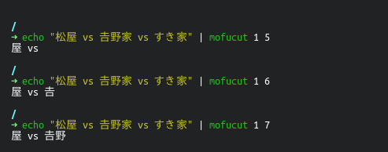

# mofucut

A tiny string substring tool which written by Nim.

## features

Supports surrogate pairs.
 


## install

```bash
sudo make install
```

## dependencies

- [Nim](https://github.com/nim-lang/Nim)

## license

MIT License
